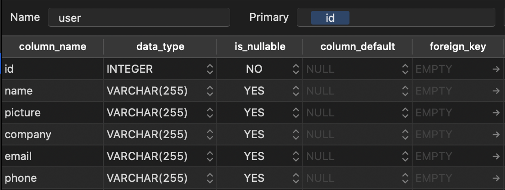
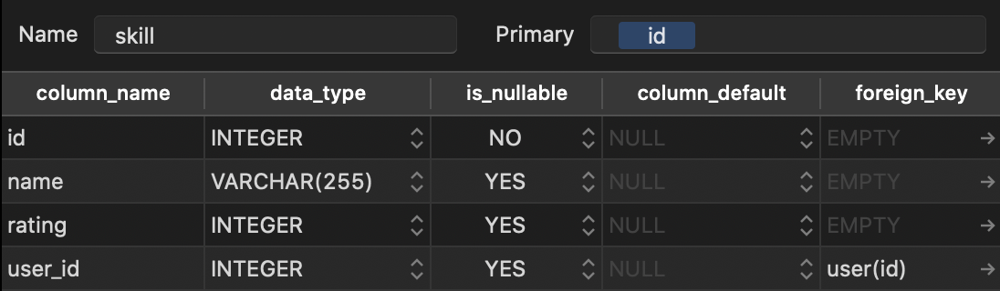

# Hack the North Backend Challenge

Try it out here: http://htnapi.kelvinzhang.ca/  
Documentation: https://documenter.getpostman.com/view/13690691/Tz5qbd1Q

## Installation
The easiest way to get up and running is through docker-compose. Running this command will also create and populate the initial database.
```bash
docker-compose up
```

Alternatively, to build from source:

1. Install [poetry](https://python-poetry.org/docs/), a Python package manager
2. Install dependencies: `poetry install`
3. Create and migrate the database: `poetry run task init_db`
4. Start the app: `poetry run task start`

## Additional features added
- Ability to add and delete users
- Ability to get the top-rated users for a skill

## Project Structure
Even though I could've put everything inside one file, I decided to organize the application in the following way for easy extensibility in the future. Everything for the API is packaged under one module.
```
.
├── ...
├── api                 # the main API module
│   ├── models          # database schemas
│   ├── controllers     # logic for each model
│   ├── routes          # list of endpoints
│   └── util            # helper functions 
├── application.py      # main entrypoint
├── populate_db.py      # script for initializing database
└── pyproject.toml      # poetry config: equivalent of package.json
```

## Dependencies
In building this project, I used the following:
- Flask and SQLite
- flask-restx
- flask_sqlalchemy
- Poetry

I chose to use Flask and SQLLite as it was easy to bootstrap a quick API, flask-restx for an added safety layer of parameter checking; and flask_sqlalchemy as an ORM because I wanted to learn about it - this was my first time using an ORM for SQL databases and I had a lot of trouble figuring out how to translate SQL queries into calls to the ORM layer. [This query was particularly nasty to figure out](https://github.com/0kzh/HTNBackendChallenge/blob/e90610106eeab815b033b9ca47636de6ffcb7c82/api/controllers/skillsController.py#L21).

In retrospect, it would've been much faster to make SQL query calls instead.

Finally, Poetry was used over `requirements.txt` since a package manager allows for better dependency management compared to `pip freeze > requirements.txt` every time. Unfortunately, AWS Elastic Beanstalk requires a `requirements.txt` file so it's still there :(

## Database Design
I had two tables, `user` and `skill`. These models can be found in [this folder](https://github.com/0kzh/HTNBackendChallenge/tree/master/api/models).




The mapping between `User` and `Skills` is a one-to-many relationship. A foreign key on user id connects the two tables. Deleting a user will also delete all related skills in the skill table.

Some optimizations were also made to speed up queries: The `user` table is indexed on `'email'` for faster search; the same is done on the `'name'` field for the `skill` table.

## API Endpoints
Postman Documentation: https://documenter.getpostman.com/view/13690691/Tz5qbd1Q

For the following endpoints, `User` has the following JSON interface
```
{
    id: string
    company: string
    email: string
    name: string
    phone: string
    picture: string
    skills: Array[Skill]
}
```

and `Skill` has the following interface
```
{
    name: string
    rating: number
}
```

### Get all Users (GET `/v1/users`)
Lists all users and their information

**Request format:** N/A  
**Response format:** `Array[User]`

### Add User (POST `/v1/users`)
Adds a user to the database and returns the created user

**Request format:** `User`  
**Response format:** `User`

### Get Specific User (GET `/v1/users/<id>`)
Gets a specific user by ID

**Request format:** N/A  
**Response format:** `User | "User does not exist"`

### Update User (PUT `/v1/users/<id>`)
Performs a partial update of a specific user and returns the updated user.

**Request format:** a partial of `User`  
**Response format:** `User | "User does not exist"` 

### Delete User (DELETE `/v1/users/<id>`)
Deletes a specific user by ID.

**Request format:** N/A  
**Response format:** `"User successfully deleted"` 

### Get Skill Frequencies (GET `/v1/skills`) 
Gets a list of skills, with optional min_frequency and max_frequency parameters.

**Request format:**
```
{
    min_frequency?: number
    max_frequency?: number
}
```
**Response format:** `Array[{ name: string, frequency: number }]` 

### Get Specific Skill (GET `/v1/skills/<name>`)
Returns the top-rated users for a specific skill

**Request format:** N/A  
**Response format:**
```
Array
[
    {
        rating: number
        user: User
    }
]
```

### Deployment
The API is deployed on AWS Elastic Beanstalk. A subdomain was set up with a CNAME to point to the deployed endpoint. In the future, automated deployments could be implemented.

## Improvements
* Using `UUID` for user id instead of a number. SQLite doesn't seem to have this as a built-in type so a custom class is needed. This would be a security improvement as it makes it harder to visit other people's profiles by typing a random number
* Adding authentication so only priveleged users & whitelisted sources can access the API
* Unit tests! I didn't implement these as creating mocks and fixtures would take a long time
* Adding HTTPS to the API if public (unnecessary if everything is in the same VPC)